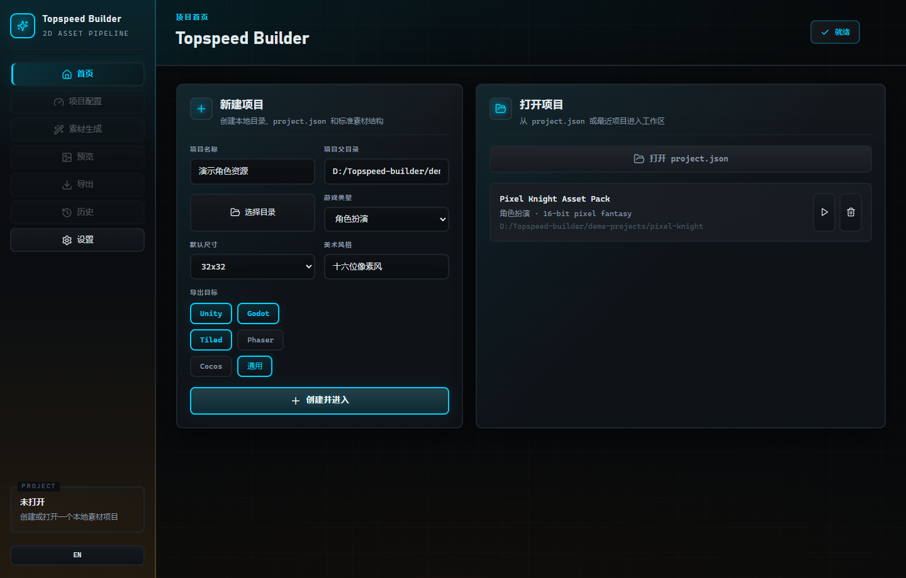
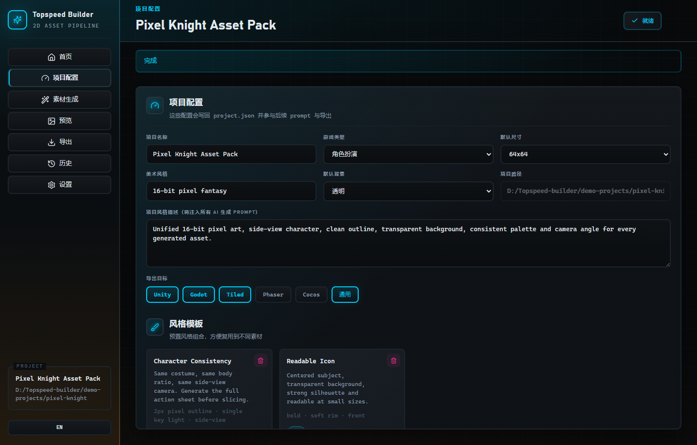
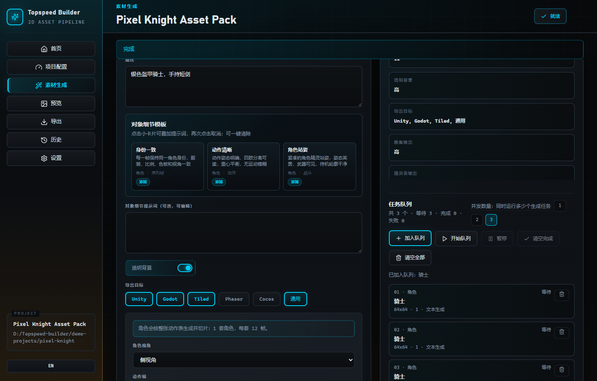
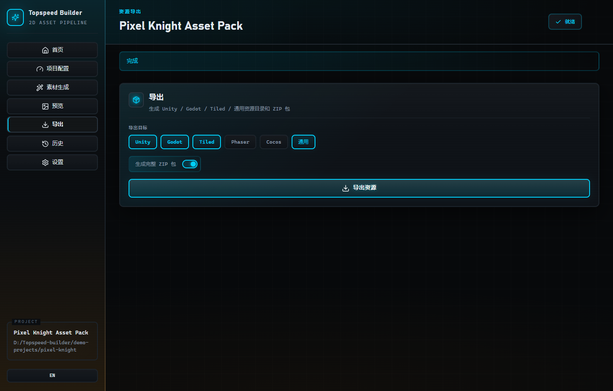
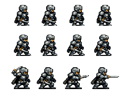

<p align="center">
  
  
  
  
  
  
</p>

<p align="center">
  <a href="#zh">中文</a> · <a href="#en">English</a>
</p>

<p align="center">
  
</p>

---

<h1 align="center" id="zh">Topspeed Builder</h1>

<p align="center">
  本地桌面端 AI 2D 游戏素材工程化生成工具。把 AI 生成结果从“好看的图片”整理成可直接导入 Unity、Godot、Tiled、Phaser 和 Cocos 的素材包。
</p>

## 项目简介

Topspeed Builder 面向独立游戏开发者、美术原型师和小型游戏团队。它不是一个单纯输入提示词的生图页面，而是一个本地素材工作台：创建项目、统一风格、批量生成图标、道具、角色、怪物、背景、特效和瓦片集，再通过本地后处理、精灵表、纹理图集和导出模板完成交付。

所有项目文件、历史记录、参考图和 API Key 都保存在本机。没有必须依赖的云端项目服务；需要联网的部分仅是你配置的图片生成接口。

## 真实界面截图

以下截图来自 `Pixel Knight Asset Pack` 示例项目，展示当前桌面应用的真实工作界面。



| 项目配置 | 素材生成队列 |
|---|---|
|  |  |

| 资源导出 | 角色源动作帧示例 |
|---|---|
|  |  |

## 核心能力

| 模块 | 能力 |
|---|---|
| 项目管理 | 创建本地项目目录、写入 `project.json`、维护最近项目 |
| 生成模式 | 文本生成、参考图生成、自定义接口、本地草稿模式 |
| 参考图工作流 | 导入主体、风格、构图、色板参考图，支持蒙版局部替换 |
| 批量生产 | 按名称列表生成图标、道具、界面素材等批量资源 |
| 角色动画 | 按动作帧配置生成角色序列，并合成 Sprite Sheet |
| 瓦片集 | 生成瓦片 PNG、预览图、元数据和 Tiled 地图文件 |
| 本地后处理 | 使用 Sharp 完成透明背景、裁切、尺寸统一和 PNG 输出 |
| 图集打包 | 合成 Texture Atlas，并输出 JSON 帧坐标 |
| 导出打包 | 生成 Unity / Godot / Tiled / Phaser / Cocos / 通用目录和 ZIP 包 |
| 历史记录 | 保存提示词、参数、输出文件和生成时间，便于回溯 |

## 典型使用流程

1. 新建或打开一个本地素材项目。
2. 配置游戏类型、美术风格、默认尺寸和导出目标。
3. 选择素材类型，并填写名称、描述、参考图、动作帧或瓦片主题。
4. 使用 `local-draft` 离线验证流程，或切换到 OpenAI 兼容接口执行真实生成。
5. 在预览页检查素材包、精灵表、图集和元数据。
6. 选择目标引擎并导出目录，可同时生成完整 ZIP 资源包。

## 快速开始

建议使用 Node.js 22。

```bash
npm install
npm run dev       # 开发模式启动 Electron 应用
npm run typecheck # TypeScript 类型检查
npm run build     # 构建到 out/
```

生产预览：

```bash
npm run build
npm start
```

打包安装包：

```bash
npm run dist:win       # Windows NSIS 安装包，输出到 release/
npm run dist:mac:arm64 # Apple Silicon DMG/ZIP，需要 macOS
npm run dist:mac:x64   # Intel Mac DMG/ZIP，需要 macOS
npm run dist:linux     # AppImage / deb
```

当前 Windows 安装包位于 `release/Topspeed Builder Setup 1.0.3.exe`。macOS 内测包位于 `release/Topspeed Builder-1.0.3-mac-arm64.dmg` 或 `release/Topspeed Builder-1.0.3-mac-x64.dmg`。

macOS 打包需要在 macOS 环境执行。CI 会通过 `.github/workflows/build-app.yml` 产出 Windows、macOS arm64 和 macOS x64 内测包；正式分发前需要 Apple Developer ID 签名和公证，流程见 [docs/mac-release.md](./docs/mac-release.md)。

### macOS 命令行运行

如果暂时没有 macOS 安装包，Mac 用户可以从源码启动：

```bash
git clone https://github.com/voicepeak/topspeed-builder.git
cd topspeed-builder
npm ci
npm run dev
```

若安装原生依赖失败，先执行 `xcode-select --install` 安装 Xcode Command Line Tools。

## 智能生成接口

在设置页配置图片生成服务：

| 配置项 | 说明 |
|---|---|
| 服务商 | `openai`、`custom` 或 `local-draft` |
| 接口密钥 | 图片生成服务的 API Key，仅保存在本机 |
| 接口基础地址 | OpenAI 兼容图片生成或图片编辑接口地址 |
| 模型 | 例如 `gpt-image-1.5`、`gpt-image-1`、`gpt-image-1-mini` |

OpenAI 兼容文本生成最小请求体：

```json
{
  "model": "gpt-image-1.5",
  "prompt": "提示词文本",
  "n": 1,
  "size": "1024x1024"
}
```

图生图模式会在本地项目中保存参考图副本，并通过 OpenAI 图片编辑兼容接口发送分段表单请求。OpenAI 官方接口支持多张参考图、可选蒙版，以及 `gpt-image-1.5` / `gpt-image-1` / `gpt-image-1-mini` 等图像模型。

`local-draft` 模式不会调用外部 API，会生成本地占位 PNG。它适合在没有密钥、没有网络或不想消耗额度时验证项目创建、队列、后处理、精灵表、图集和导出链路。

## 本地项目结构

```text
project.json
generated/
  raw/
  processed/
sprites/
icons/
tilesets/
sheets/
atlas/
exports/
history/
references/
  images/
  masks/
  thumbnails/
```

## 导出目标

| 目标 | 输出内容 |
|---|---|
| Unity | PNG、Sprite Sheet、Atlas、JSON 元数据、导入说明 |
| Godot | PNG、Sprite Sheet、SpriteFrames 说明、JSON 元数据、导入说明 |
| Tiled | TileSet PNG、TileSet JSON、TMX 地图文件、导入说明 |
| Phaser / Cocos | PNG、Sprite Sheet、Atlas、JSON 帧数据 |
| 通用 | 通用 PNG + JSON 元数据 |
| ZIP | 完整导出资源包 |

## 技术栈

| 层级 | 技术 |
|---|---|
| 桌面壳 | Electron 33 |
| 前端 | React 18、TypeScript、Lucide React |
| 国际化 | i18next、react-i18next |
| 构建 | Vite 5、electron-vite、electron-builder |
| 图像处理 | Sharp |
| 归档导出 | JSZip |
| 本地存储 | JSON 文件、项目目录、Electron userData |

## 相关文档

- [产品 PRD](./topspeed-builder-PRD.md)
- [macOS 构建与发布](./docs/mac-release.md)
- [静态项目文档页](./docs/index.html)

## 协议

MIT

---

<h1 align="center" id="en">Topspeed Builder</h1>

<p align="center">
  A local desktop pipeline for turning AI-generated images into production-ready 2D game asset packages.
</p>

## Overview

Topspeed Builder is an Electron + React + TypeScript desktop app for indie developers, art prototypers, and small game teams. It creates local asset projects, standardizes style settings, generates 2D game assets, post-processes images locally, builds sprite sheets and texture atlases, then exports engine-friendly folders and ZIP bundles.

Project files, history, reference images, and API keys stay on the local machine.

## Screenshots


| Project Settings | Generation Queue |
|---|---|
|  |  |

| Export Targets | Character Frame Example |
|---|---|
|  |  |

## Capabilities

| Area | What it does |
|---|---|
| Projects | Creates local project folders, writes `project.json`, manages recent projects |
| Generation | Supports text-to-image, image-to-image, custom APIs, and local draft mode |
| References | Imports subject/style/composition/palette references and optional masks |
| Batch Assets | Generates icon, item, UI, character, enemy, background, effect, and tileset assets |
| Sprite Sheets | Composes character frames into animation sheets with metadata |
| TileSets | Builds tile PNGs, previews, JSON metadata, and Tiled maps |
| Post-Processing | Uses Sharp for transparency, trimming, resizing, and PNG output |
| Exports | Creates Unity, Godot, Tiled, Phaser, Cocos, common folders, and ZIP bundles |

## Typical Workflow

1. Create or open a local asset project.
2. Configure game type, art style, default size, and export targets.
3. Choose an asset type, then fill in name, description, references, animation frames, or tileset theme.
4. Use `local-draft` to validate the pipeline offline, or switch to an OpenAI-compatible API for real generation.
5. Review generated assets, sprite sheets, atlases, and metadata in the preview page.
6. Export engine-specific folders and optionally create a complete ZIP package.

## Quick Start

Node.js 22 is recommended.

```bash
npm install
npm run dev
npm run typecheck
npm run build
```

Production preview:

```bash
npm run build
npm start
```

Packaging installers:

```bash
npm run dist:win
npm run dist:mac:arm64
npm run dist:mac:x64
npm run dist:linux
```

Build artifacts are written to `release/`. macOS distribution requires Developer ID signing and notarization; see [docs/mac-release.md](./docs/mac-release.md).

### macOS CLI Run

If a macOS installer is not available, Mac users can run from source:

```bash
git clone https://github.com/voicepeak/topspeed-builder.git
cd topspeed-builder
npm ci
npm run dev
```

If native dependency installation fails, install Xcode Command Line Tools with `xcode-select --install`.

## AI Generation API

Configure the image generation service in Settings:

| Field | Description |
|---|---|
| Provider | `openai`, `custom`, or `local-draft` |
| API Key | Image generation service API key, stored locally |
| API Base URL | OpenAI-compatible image generation or image edits endpoint |
| Model | For example `gpt-image-1.5`, `gpt-image-1`, or `gpt-image-1-mini` |

Minimal OpenAI-compatible text-to-image request body:

```json
{
  "model": "gpt-image-1.5",
  "prompt": "prompt text",
  "n": 1,
  "size": "1024x1024"
}
```

Image-to-image mode stores local reference copies inside the project and sends multipart requests to an OpenAI-compatible image edits endpoint. Official OpenAI image APIs support multiple reference images, optional masks, and GPT Image models such as `gpt-image-1.5`, `gpt-image-1`, and `gpt-image-1-mini`.

`local-draft` mode creates local placeholder PNGs without external API calls. It is useful for validating project creation, queues, post-processing, sprite sheets, atlases, and exports without a key or network access.

## Local Project Structure

```text
project.json
generated/
  raw/
  processed/
sprites/
icons/
tilesets/
sheets/
atlas/
exports/
history/
references/
  images/
  masks/
  thumbnails/
```

## Export Targets

| Target | Output |
|---|---|
| Unity | PNG, Sprite Sheet, Atlas, JSON metadata, import notes |
| Godot | PNG, Sprite Sheet, SpriteFrames notes, JSON metadata, import notes |
| Tiled | TileSet PNG, TileSet JSON, TMX map file, import notes |
| Phaser / Cocos | PNG, Sprite Sheet, Atlas, JSON frame data |
| Common | Generic PNG + JSON metadata |
| ZIP | Complete exported asset package |

## Tech Stack

| Layer | Technology |
|---|---|
| Desktop Shell | Electron 33 |
| Frontend | React 18, TypeScript, Lucide React |
| i18n | i18next, react-i18next |
| Build | Vite 5, electron-vite, electron-builder |
| Image Processing | Sharp |
| Archive Export | JSZip |
| Local Storage | JSON files, project directory, Electron userData |

## Related Docs

- [Product PRD](./topspeed-builder-PRD.md)
- [macOS Build and Release](./docs/mac-release.md)
- [Static project documentation page](./docs/index.html)

## License

MIT
